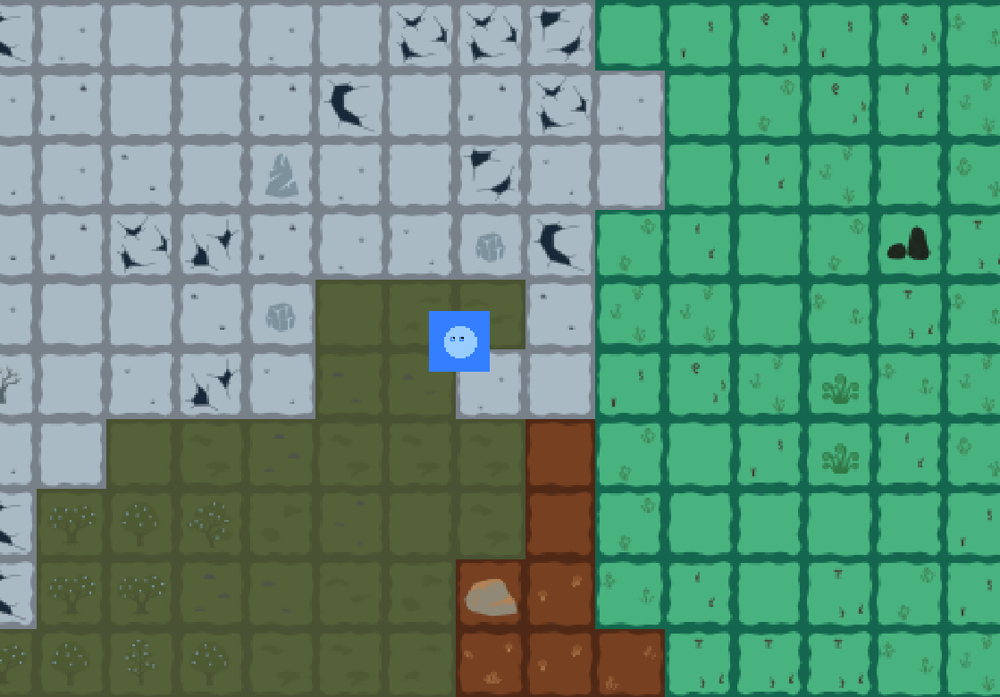
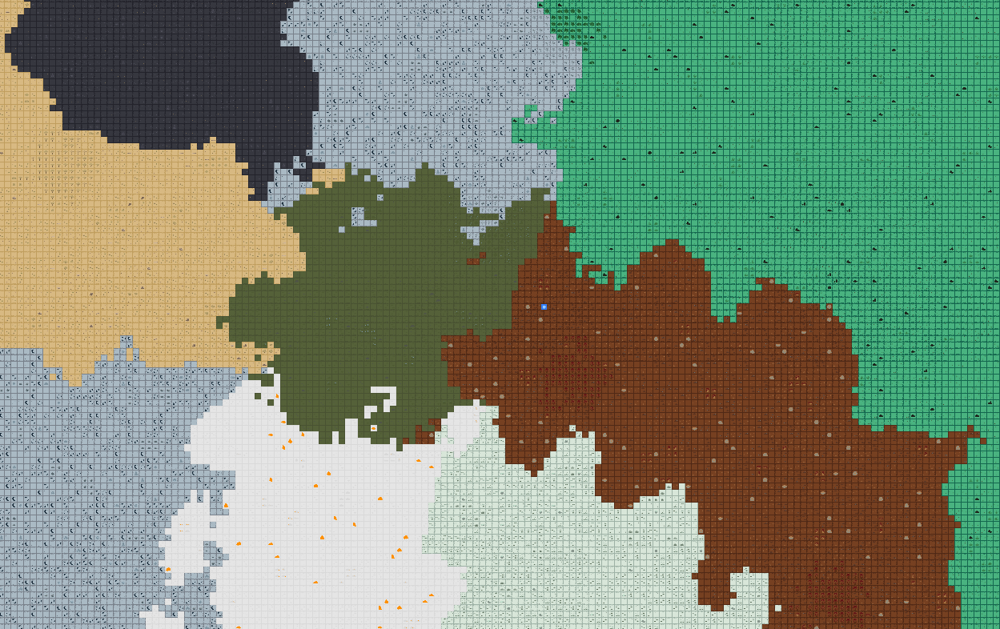
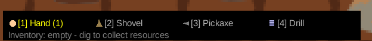
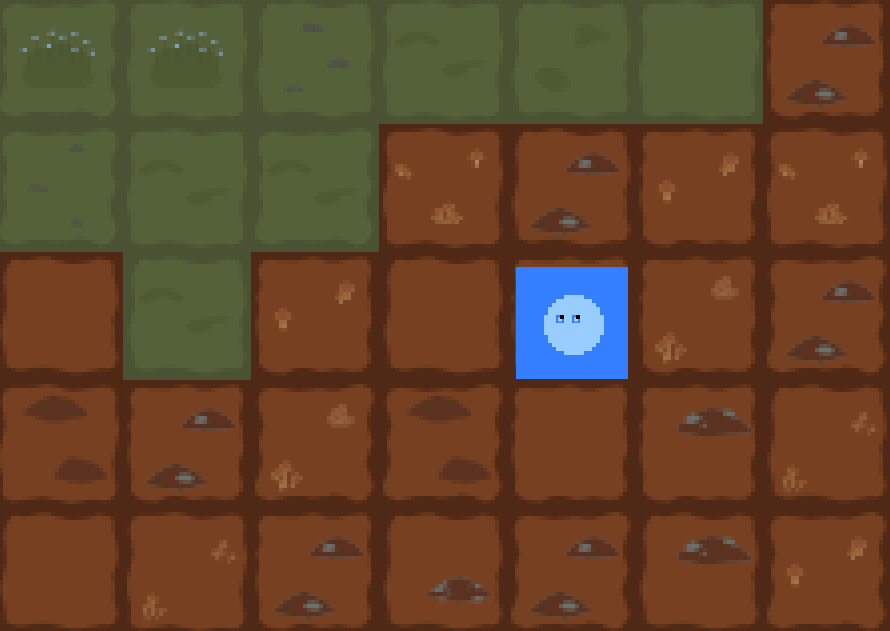
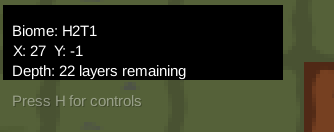
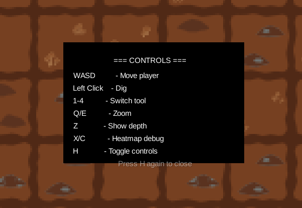

# FactoryGame

### Gra o kopaniu w nieskończonym świecie

Jest to 2D gra w stylu pixel-art gdzie kopiesz, zbierasz zasoby i eksplorujesz losowo generowany świat.



**Technologie:** Java + libGDX | **Gatunek:** Sandbox / Kopanie | **Platforma:** Desktop (LWJGL3)

---

## 1: Architektura

```
FactoryGame/
├── core/                          # Logika gry
│   ├── Main.java                  # Start, pętla gry, wejście
│   ├── Player.java                # Postać z oczami które się poruszają
│   ├── HUD.java                   # Interfejs na ekranie
│   ├── ToolType.java              # Typy narzędzi (RĘKA/ŁOPATA/KILOF/WIERTARKA)
│   ├── DigEffect.java             # Błyski, iskry, animacja narzędzi
│   ├── TextureManager.java        # Tekstury proceduralne + SVG
│   ├── RenderSystem.java          # Rysowanie kafelków
│   ├── HeatmapColorizer.java      # Kolory dla map temperatury
│   └── InfiniteWorldGen/          # Generowanie świata
│       ├── World.java             # Zarządza chunkami
│       ├── Chunk.java             # Siatka 32×32 kafelków
│       ├── ChunkGenerator.java    # Tworzy biomy, głębokość, zasoby
│       ├── FastNoiseLite.java      # Szum Perlin/Simplex
│       ├── TileVariationSystem.java # Warianty kafelków
│       └── Rendering/
│           └── BiomeTextureCache.java # Wczytywanie SVG
├── assets/                        # Pliki graficzne
│   ├── bases/                     # 9 bazowych SVG biomów
│   └── terrain/                   # Tekstury terenu
└── lwjgl3/                        # Uruchamianie na desktop
```

**Użyte technologie:**

- **libGDX** - Framework do gier
- **LWJGL3** - Uruchamianie na Windows/Mac/Linux
- **AmanithSVG** - Rysowanie wektorowych SVG
- **FastNoiseLite** - Generowanie losowego terenu
- **Gradle** - Budowanie projektu

## 2: Świat



**Nieskończony świat generowany na bieżąco**

- 9 różnych biomów tworzonych na podstawie temperatury i wilgotności
- Świat dzieli się na chunki 32×32 kafelki, generowane w momencie wejścia
- Biomy: Dżungla, Zamrożona Tundra, Pustynia Bazaltowa, Grzybowy Las, Las Spor, Surowne Step, Wzgórza Mechowe, Porastające Schodki, Pęknięta Zmarzlina
- Każdy biom ma własne tekstury, drzewa, kamienie i kolory

**Sterowanie:**

- WASD - Ruch postaci
- Q/E - Przybliż/oddal
- Kamera podąża za graczem

---

## 3: Mechanika kopania



**4 rodzaje narzędzi** (klawisze 1-4):

1. **Ręka** (1 warstwa/klik) - Na start
2. **Łopata** (3 warstwy/klik) - Szybciej
3. **Kilof** (6 warstw/klik) - Do wydobywania
4. **Wiertarka** (12 warstw/klik) - Maksymalna moc

**13 typów zasobów:**

- Zwykłe: Wapień, Węgiel, Żelazo, Miedź
- Rzadkie: Złoto, Kwarc, Boksyt, Siarka
- Cenne: Diament, Rubin, Lit, Tytan, Uran

Zasoby pojawiają się na różnych głębokościach, im głębiej, tym rzadsz.

---

## 4: Efekty i detale



**Różne efekty przy kopaniu:**

- Biały błysk na kafelku po każdym uderzeniu (0.2s)
- Animacja ruchu narzędzia (0.15s) - widać jak narzędzie wlatuje w kafelek
- Żółte iskry gdy znajdziesz zasób (0.5s)
- Tekst "+1 ZŁOTO" leci do góry gdy zbierzesz coś
- Kolorowe kwadratki przy zasobach w pasku inwentarza

**Postać**

- Niebieska kropka z oczami
- Oczy podążają za kierunkiem ruchu (góra/dół/lewo/prawo)
- Gdy się zatrzymasz, oczy powoli wracają na środek

---

## 5: Interfejs



**Co widać na ekranie:**

- Góra-lewo: Nazwa biomu, współrzędne X/Y, ile warstw zostało do dna
- Dół: Pasek z narzędziami (aktualne podświetlone na żółto)
- Dół: Inwentarz z zebranymi zasobami (kolorowe kwadratki + liczby)
- Naciśnij **H** aby zobaczyć wszystkie sterowanie



**Tryby debug:**

- X - Mapa temperatury
- C - Mapa wilgotności
- Z - Pokaż liczby głębokości

---
